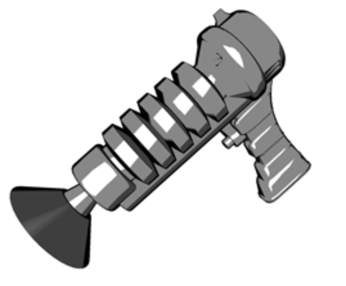
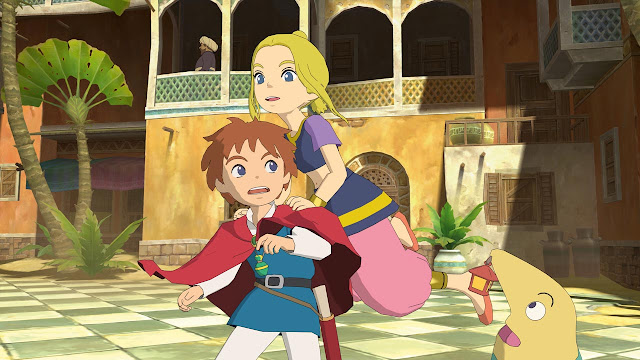
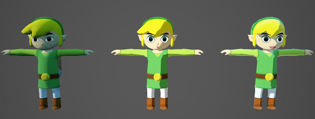
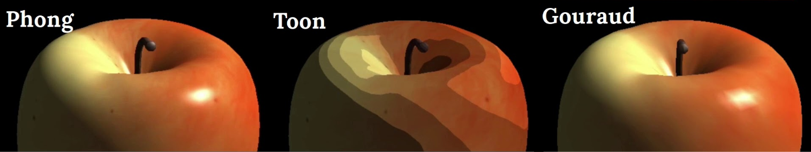
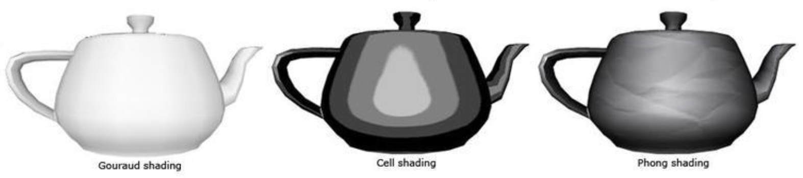

# Enunciado
Na aula desta semana, vimos como algumas equações matemáticas são usadas para calcular o visual de uma superfície 3D iluminada por uma fonte de luz, dando um aspecto mais realista aos objetos.

Dependendo da aplicação, podemos optar por um visual que se distancia do realismo, usando técnicas conhecidas como NPR (non-photorealistic rendering).

Um dos exemplos mais comuns de NPR é o visual cartoon (desenho).

Faça uma pesquisa sobre a técnica de toon/cel shading e escreva um resumo sobre como essa técnica funciona.

Além da descrição da técnica, inclua em seu resumo:

- As semelhanças e diferenças entre o toon/cel shading e o Gouraud/Phong shading.
- Inclua imagens que mostrem modelos 3D renderizados usando toon/cel shading.
- Inclua imagens que comparem o toon/cel shading com Gouraud/Phong shading.

Lembre-se de incluir todas as referências consultadas (livros, links de artigos, vídeos, etc.) e identificar todas as pessoas do grupo.

Publique o resultado dessa atividade no blog.
## Nome e RA
Larissa Rafaela Rodrigues Nepomuceno
# Referências
- https://developer.download.nvidia.com/CgTutorial/cg_tutorial_chapter09.html
- https://www.packtpub.com/en-cl/product/papervision3d-essentials-7-9781847195722/chapter/shading
- https://www.nerdmaldito.com/2010/10/cel-shaded-3d-com-visual-de-desenho.html
- https://www.youtube.com/watch?app=desktop&v=dHfu3VkoZ5U
- https://profkishimoto.github.io/compvis07g-2024-1/conteudo/semana-14/Shaders%20-%20Ilumina%C3%A7%C3%A3o.pdf

# NPR - técnica de toon/cel shading
Toon shading é uma técnica de renderização que tonaliza objetos com cores constantes e bem delineadas, como se elas fossem cartoon ao invés de objetos reais.
Um aspecto útil do toon shading é que não é necessário mudar a forma como os personagens e objetos são representados. Em vez de desenhar tudo como imagens bidimensionais, pode ser desenhado em malhas tridimensionais. O truque está no shading, ao substituir um sombreador de iluminação convencional por um novo tipo de shading, essas renderizações pode parecer cartoons. Para o toon shading, o objetivo é reduzir a variação em shading.

O toon shading possui três componentes principais:
- O diffuse shading precisa ser representado por apenas dois valores: um para as regiões claras e outro para as regiões escuras.
- Os Specular highlights precisam ser identificados e representados como uma única cor onde sua intensidade é suficientemente alta.
- Os objetos precisam ser contornados para completar o visual de cartoon.

O toon shader funciona convertendo o diffuse shading de várias tonalidades em poucas. Em um exemplo monocromático com diffuse shading, cada pixel tem uma cor variando de 0.0 a 1.0. Para criar um toon shader, esse intervalo contínuo pode ser dividido em dois intervalos distintos: pixels de 0.0 a 0.5 são representados por 0.2, e pixels de 0.5 a 1.0 são representados por 1.0, resultando em uma imagem com duas tonalidades e aparência de cartoon. Essa conversão é chamada de step function, que mapeia uma ampla gama de cores em apenas duas, podendo também usar funções com mais degraus se necessário.

## Semelhanças e diferenças entre toon/cell shading e Gouraud shading e Phong shading

| | Toon shading  | Gouraud shading | Phong shading |
| ------------- | ------------- | ------------- | ------------- |
| Finalidade | Shading e iluminação em modelos 3D  | Shading e iluminação em modelos 3D  | Shading e iluminação em modelos 3D |
| Componentes | Pode usar difusão, especularidade e ambiente na iluminação | Pode usar difusão, especularidade e ambiente na iluminação | Pode usar difusão, especularidade e ambiente na iluminação |
| Base | Malha 3D para criar a percepção de profundidade e forma | Malha 3D para criar a percepção de profundidade e forma | Malha 3D para criar a percepção de profundidade e forma |
| Estilo | Cartoon | Realista  | Realista |
| Método de shading | Utiliza step function para limitar as cores a poucos tons discretos  | Interpola a iluminação dos vértices de um triângulo para os pixels internos | Interpola as normais dos vértices e calcula a iluminação para cada pixel |
| Iluminação | Simplicidade nas cores com dois ou mais níveis de iluminação | Calcula a iluminação nos vértices e interpola os resultados | Calcula a iluminação por pixel, usando a normal interpolada dos vértices |
| Complexidade | Menos complexo, pois não requer cálculos detalhados por pixel | Moderadamente complexo, com cálculos feitos nos vértices e interpolação nos pixels | Mais complexo, com cálculos por pixel |

## Modelos 3D renderizados usando toon/cell shading

## Toon/cel shading x Gouraud/Phong shading

